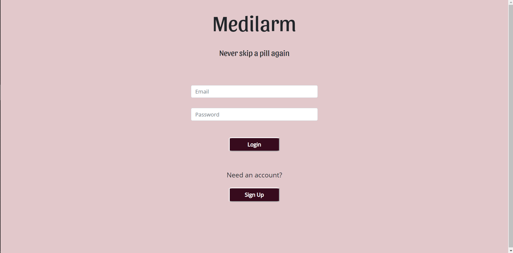
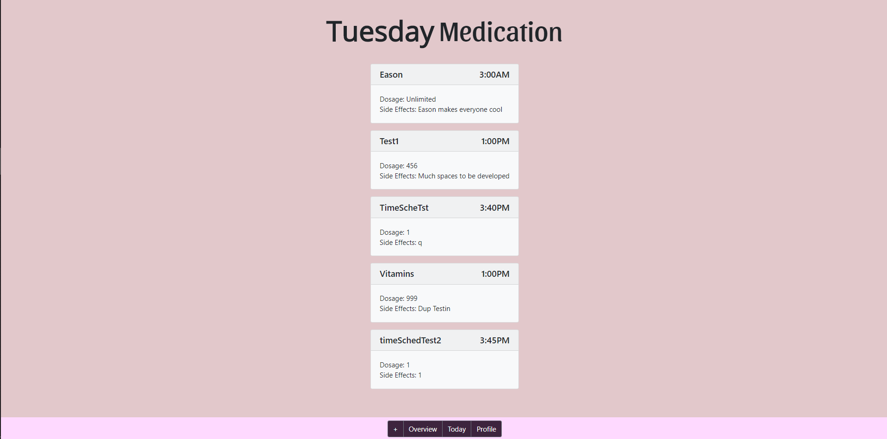
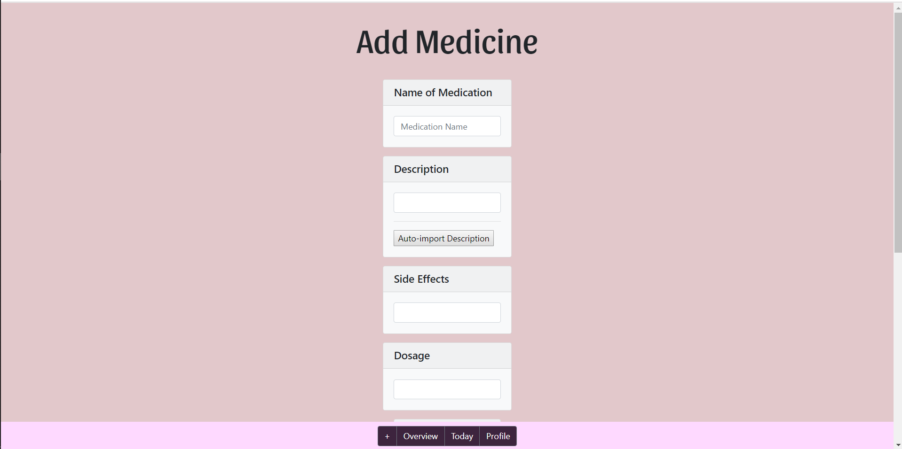
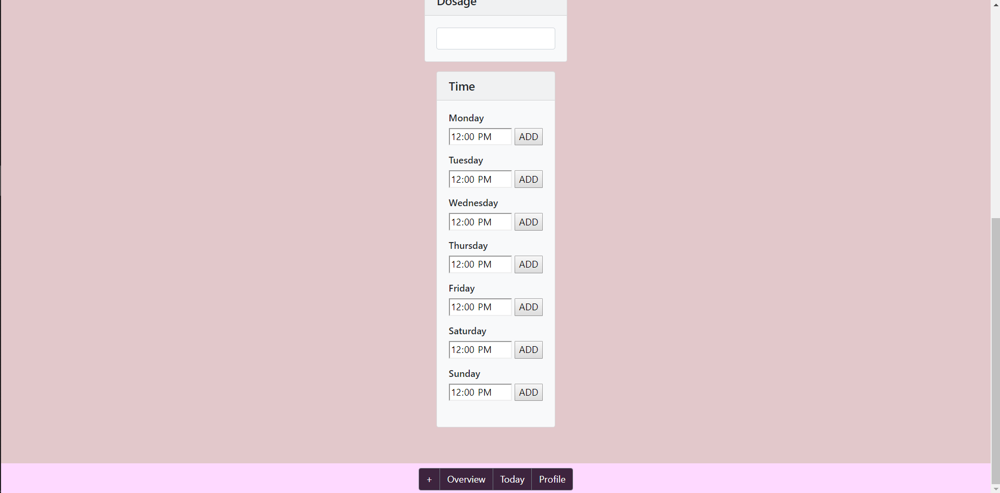
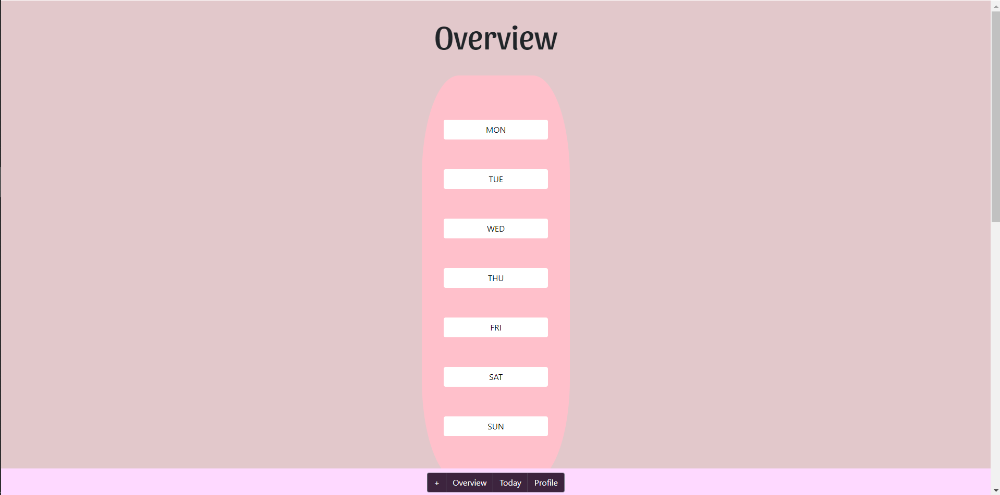
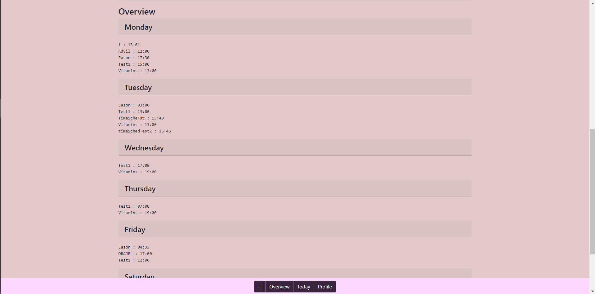
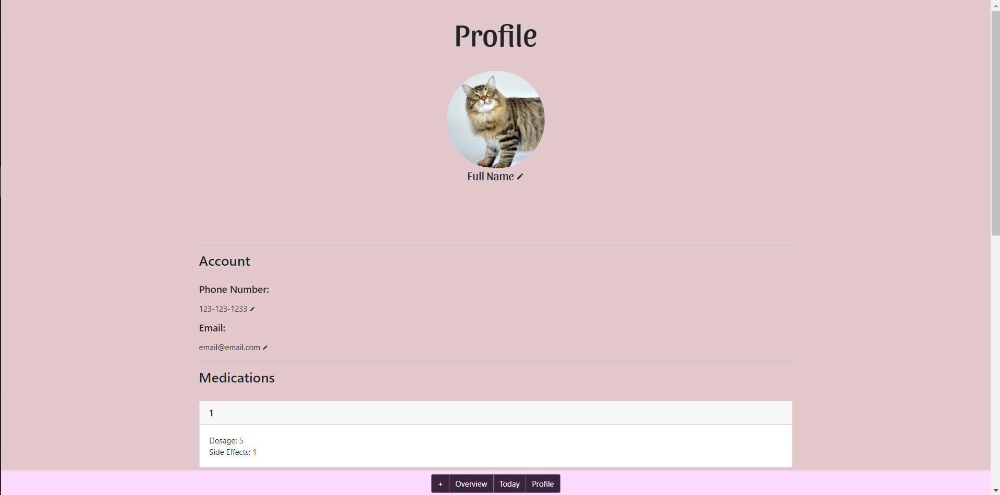
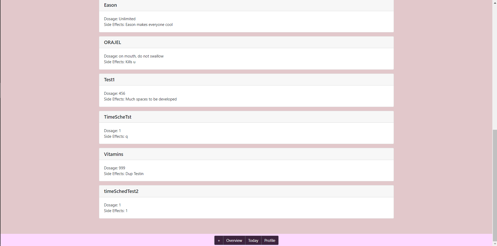

# Team Name: Endgame
### Team Members: Daniel Gwag, David Liau, Yun Tang (Denise), Michelle Yang

# Project Milestone 5

Improvements

## Screenshots of updated UI

### Log-in Page

### Home Page

### Add Medicine Page

### Overview Page

### Profile Page

## UI Skeleton Improvements
This milestone's UI is mainly an improvement over other versions in terms of its CSS formatting. We changed a couple of buttons, making them look more sleek and in-tune with the app's structure, and ordered cards, textboxes, and labels alike to consistent formatting. This also included adding Bootstrap to multiple textboxes along with editing buttons. Finally, we were able to provide spacing between multiple cards, and change the footer background color to a higher contrast.

## Target User Population App Usage for Relevant Goals
Most seniors in this day and age consume countless vitamins and medications. The ingestion of pills has become a part of their every day schedule, solidifying itself as a mandatory task. Yet many seniors often forget to take their medicine when necessary, leading to potentially dangerous situations. Our app, Medilarm, tackles this issue with a simplified interface and automated telephone service. Once a senior's medicinal information is entered into Medilarm, it punctually contacts each individual with a call to their phone, notifying them to take their medicine. This way, seniors don't have to take on the burden of remembering medicine times, and can be assured that they stay healthy.

## Screenshots of Data Visualization

### Home Page

### Overview Page

### Profile Page

### Specific Medicine Page

## Data Implementation Explanation
To visualize our medicinal data, we connected our application to Google Firebase. There, we manually input a few medicinal examples into the database. Whenever someone adds a medicine, we also append the field to Firebase; and when Profile or Home is pressed, we retrieve information pertaining to the user. Finally, we display the data in the form of several cards, divided by subcategory.

## Future Data Visualization Ideas
Although this isn't entirely necessary, we would hope to provide some graphical representation of how often seniors take their medicine without being reminded. We would also like to provide some method of displaying the amount of medicine consumed and remaining, especially for medicines with a longer duration of dosage.
