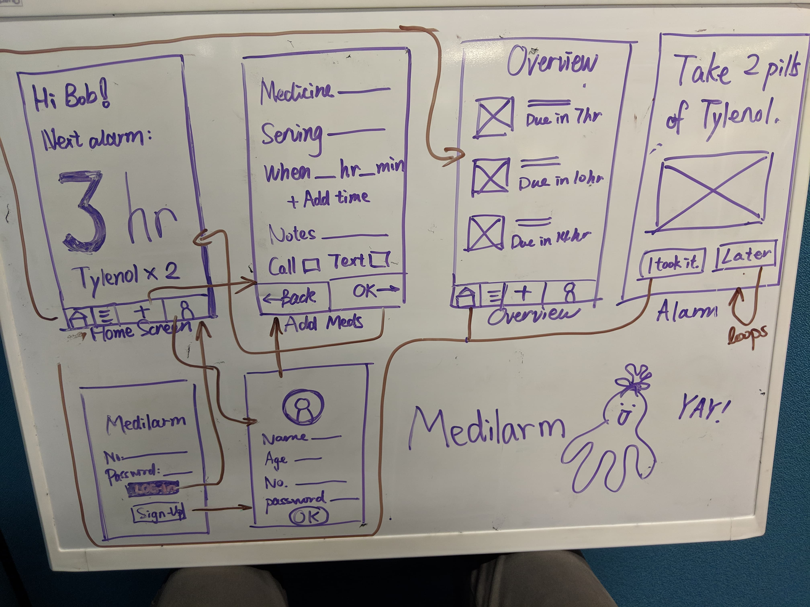

# Team Name: Endgame
### Team Members: Daniel Gwag, David Liau, Yun Tang (Denise), Michelle Yang
## Pitch:
Our web application’s target population consists primarily of elderly individuals who need to take medicine, but cannot necessarily remember the details related to their medication (including what they are for, when to take them, etc), as well as their caretakers. None of our team members are part of the target user population because we do not need to take medicine consistently, nor are we responsible for anyone who does. Some possible real-world APIs we could use are: Twilio for sending phone calls, Google Cloud Platforms Vision API to convert an image of medicine instructions to text, and Google Firebase to store our users’ information.

## Storyboard 1

## Storyboard 2

## Paper Prototype 1

## Paper Prototype 2

