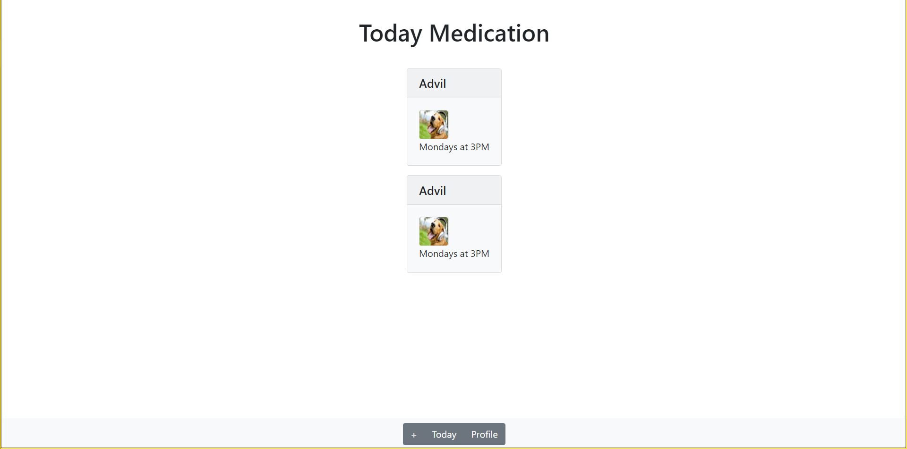
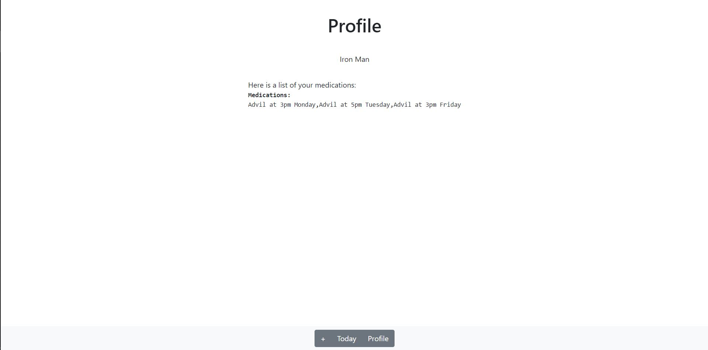

# Team Name: Endgame
### Team Members: Daniel Gwag, David Liau, Yun Tang (Denise), Michelle Yang

# Project Milestone 2

A skeleton for both your frontend and backend

### Updates

Our idea is largely similar to the one we proposed in Milestone 1, although we have decided to focus our application on a particular audience. We ultimately chose to cater our web application primarily towards elderly individuals, with the caretakers of the elder to be included as a stretch goal. This will impact our overall front-end architecture, as we aim to design our application in a format that is easily readable/accessible.

### Screenshots

### Log-in Page

### Home Page

### Add Medicine Page

### Medicine Page

### Profile Page

Explanation: Log-in Page stays the same as the prototypes. We picked the homepage of prototype 1 as the homescreen which gives an overview of all the scheduled medicine for the day. The medicine page has the same information as the prototype does besides the fact that it's not editable. The profile page contains the user's name, phone number and corresponding medicines. However, the visual design in the paper prototypes is replaced with a list for now. 

In general, we decided to make the app more light weight and reduce the learning curve by having less screens. Only the essential screens are kept. We also chose the navigation bar design in prototype 2 and added it to all the screens.
