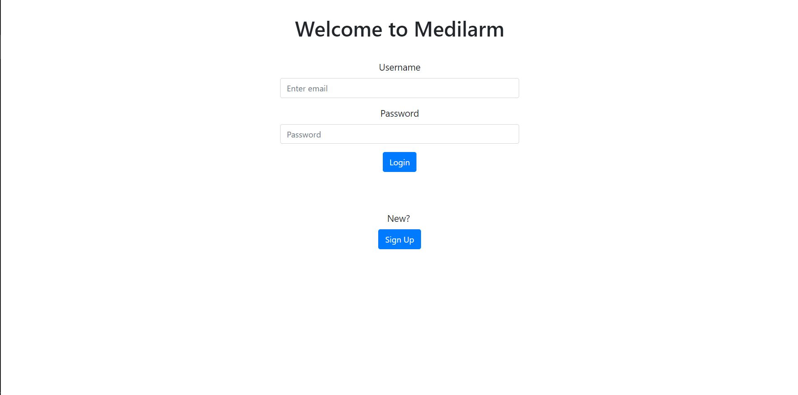
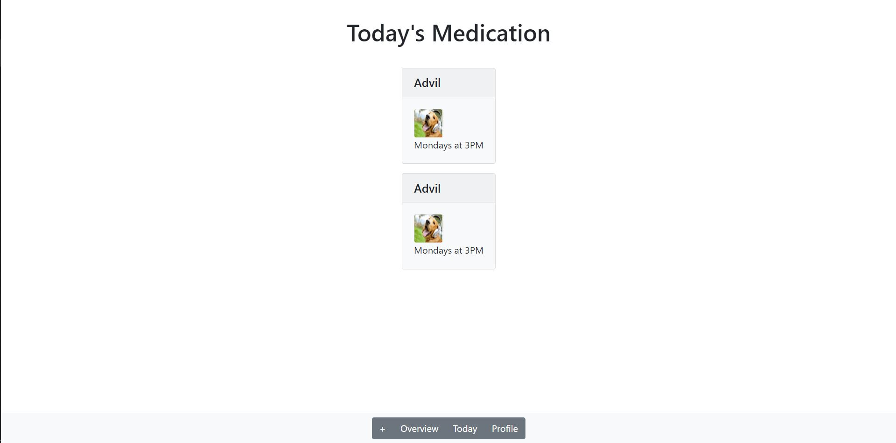
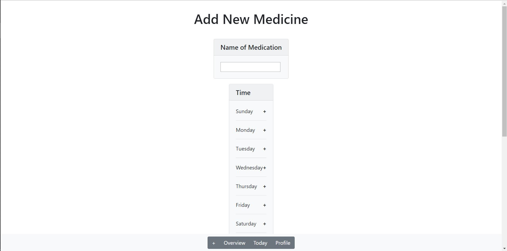
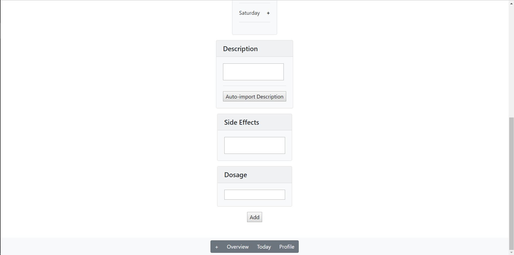
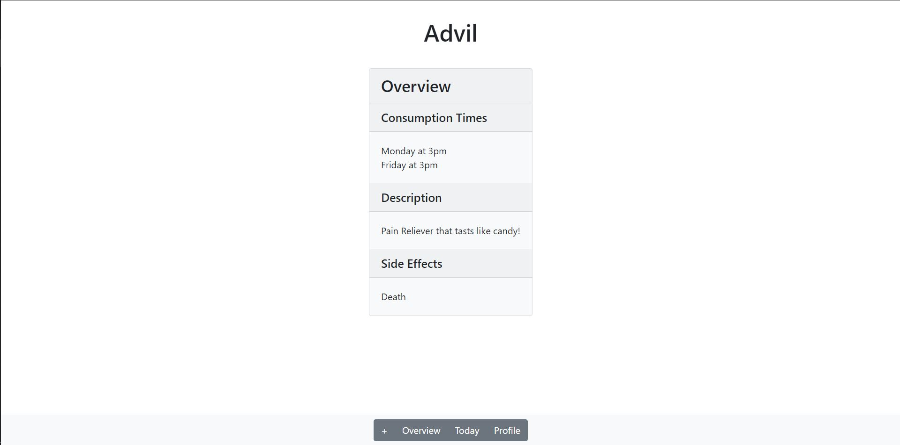
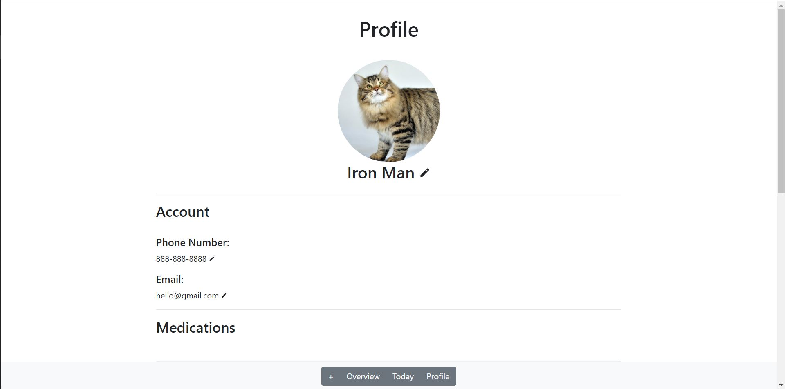
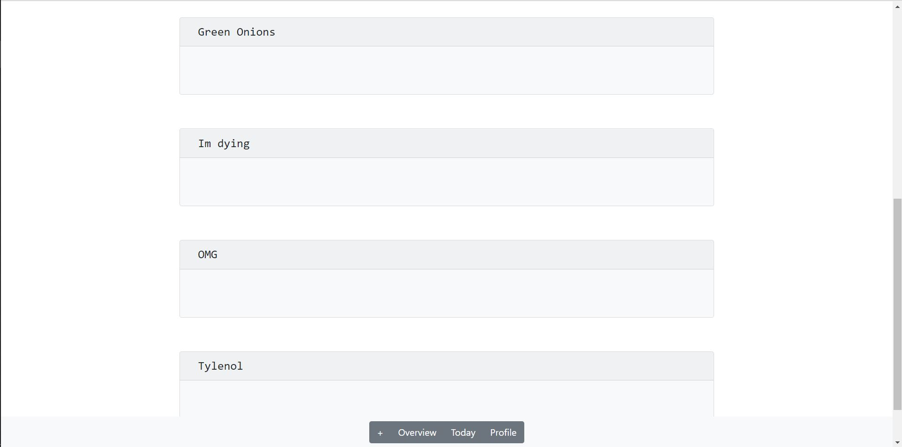

# Team Name: Endgame
### Team Members: Daniel Gwag, David Liau, Yun Tang (Denise), Michelle Yang

# Project Milestone 3

Backend to Data Source

## Screenshots of updated UI

### Log-in Page

### Home Page

### Add Medicine Page

### Medicine Page

### Profile Page

## UI Skeleton Improvements
Our new UI Skeleton features a lot more of the usage of Bootstrap's cards. We made this decision because we felt that the blocky-ness and large text style of the bootstrap card was a lot easier for seniors to understand. In addition, by having cards be a central theme in all our pages, it tied the aesthetic of our application together to form one fluid ecosystem. The biggest improvement can be seen on the “Add New Medicine” page, where before, the inputs were very close together but now, with the Bootstrap cards, are much farther apart with BIGGER input boxes. The same goes for the profile page. The user’s medications were previously all listed on one line but now they are very big cards listed in a column format. All these pages now match our main “Today” screen a lot better.
