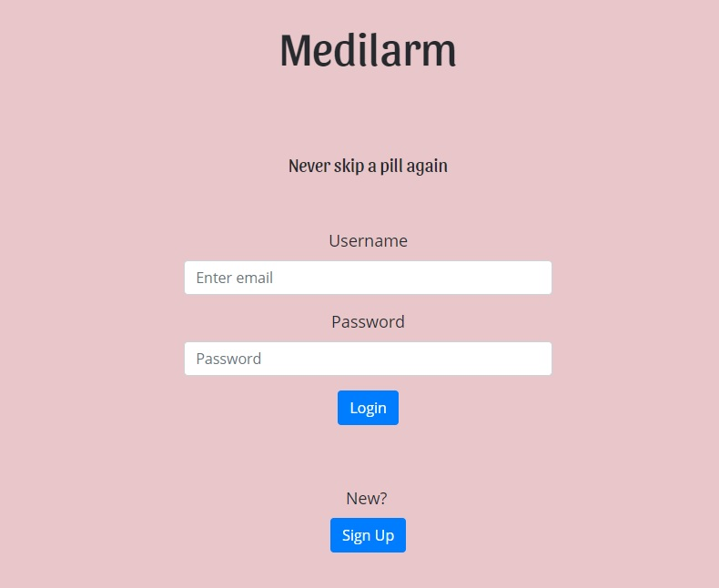
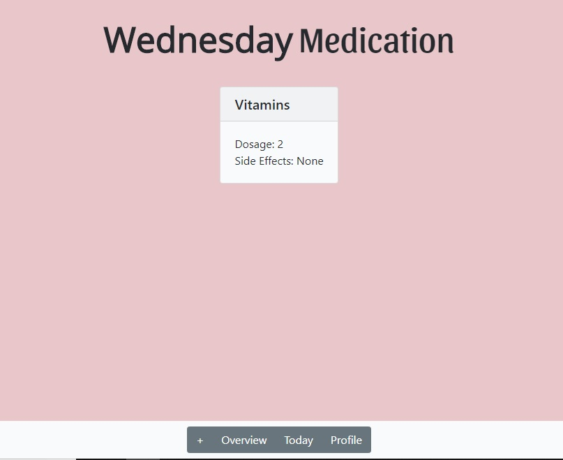
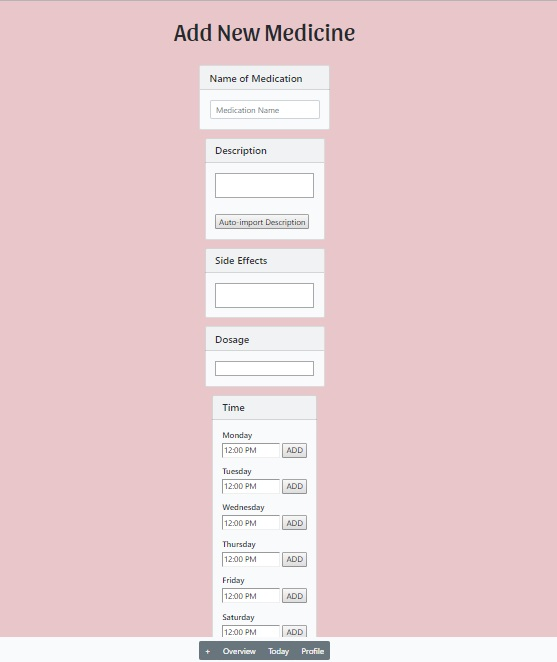
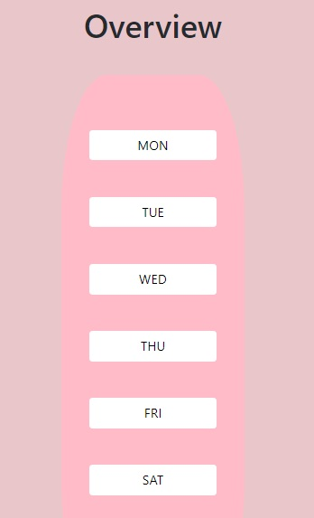
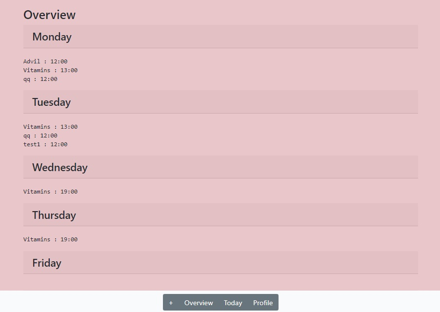
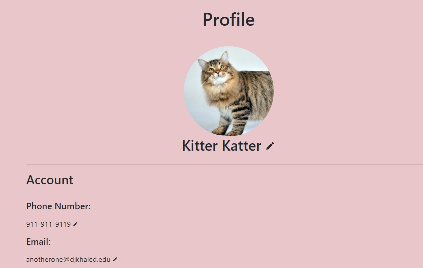
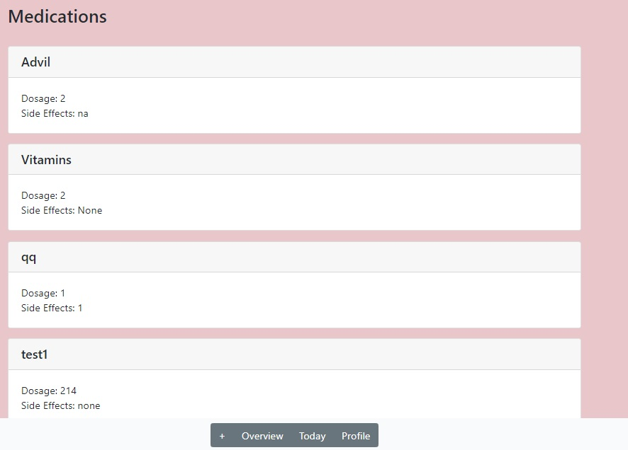

# Team Name: Endgame
### Team Members: Daniel Gwag, David Liau, Yun Tang (Denise), Michelle Yang

# Project Milestone 4

Improvements

## Screenshots of updated UI

### Log-in Page

### Home Page

### Add Medicine Page

### Medicine Page

### Profile Page

## UI Skeleton Improvements
Previously, the data was displayed in cards with no data inside. Now, each card is displayed with the most pertinent information, the dosage required and the side effects.
In addition, the Medicine Page and Profile page cards match the home screen cards now (they are not gray). Also, the Medicine page cards are now more spaced out and accurately displays information about a medicine. We also have slowly begun to add fonts and colors to our skeleton as you can see on our Home page and Login page.  

## Non-Trivial Actions
1. Users can add a new medication that they are to take weekly. That medicine will get saved into our database and displayed on multiple sections of our application.
Once logged in, users need to press the + button at the bottom of the page. Then, each field is to be filled out accordingly. Once done, the user can press the Add button at the bottom of the page.

2. Users can view which medicines they need to take each day in many places, and also view specific information about that medicine.
Users can do this by navigating to the Profile page on the bottom bar. Then, after scrolling down, all the medications that the user has added to their account is shown with the dosage and side effects. These cards can be clicked which would bring you to a page all about that one particular medicine. 
